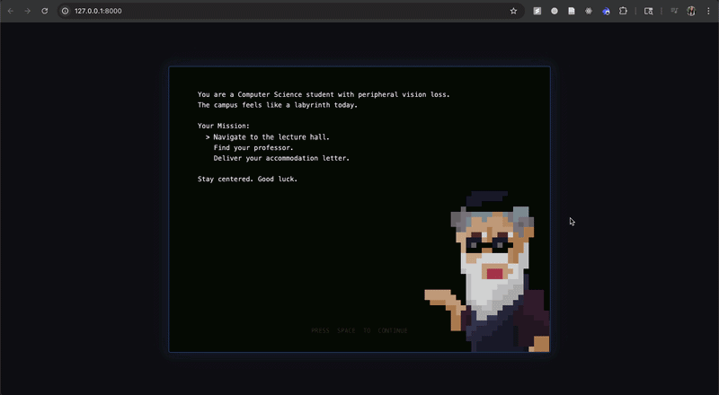
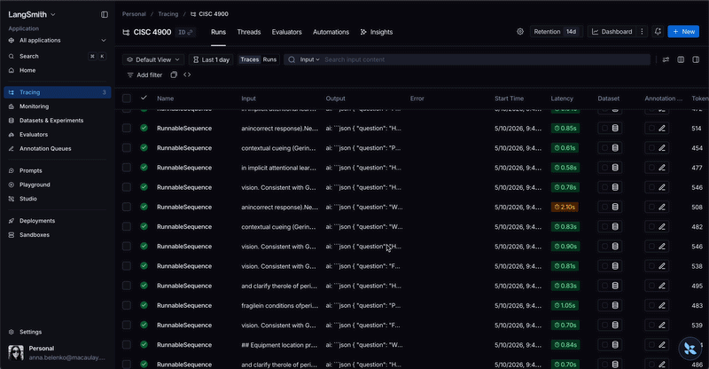

# CISC 4900 — Beyond Barriers

A 2D educational platformer built with [Phaser 3](https://phaser.io/) about disability and accessibility on a college campus. Players navigate two scenes — a security checkpoint and a classroom — collecting quiz tokens that trigger AI-generated accessibility questions powered by a RAG pipeline backed by Google Gemini. Features tunnel vision simulation, text-to-speech narration, a selectable HTML UI, pixel-art sprites, an anxiety meter, and sound effects throughout.

## Finished Demo





## Older Demo


---

## 📋 Prerequisites

- **Node.js** (version 14 or higher) — [Download here](https://nodejs.org/)
- **npm** (comes with Node.js)
- **Python 3.12** — [Download here](https://www.python.org/downloads/release/python-3122/) *(3.12 recommended — newer versions may have compatibility issues with some dependencies)*
- A **Google AI API key** — [Get one here](https://ai.google.dev/)
- An **ElevenLabs API key** — [Get one here](https://elevenlabs.io/)
- A modern web browser (Chrome, Firefox, Safari, Edge)

---

## 🚀 Getting Started

### 1. Clone the Repository
```bash
git clone https://github.com/annabelenko/CISC4900
cd CISC4900
```

### 2. Install Frontend Dependencies
```bash
npm install
```

### 3. Set Up the Backend
```bash
cd backend
python3 -m venv venv

# Mac/Linux:
source venv/bin/activate

# Windows:
venv\Scripts\activate

pip install -r requirements.txt
```

### 4. Configure Environment Variables

Create a `backend/.env` file with your API keys:
```
LANGSMITH_TRACING=true
LANGSMITH_ENDPOINT=https://api.smith.langchain.com/
LANGSMITH_API_KEY=your-langsmith-key-here
LANGSMITH_PROJECT="CISC 4900"
GOOGLE_API_KEY=your-google-api-key-here
ELEVENLABS_API_KEY=your-elevenlabs-api-key-here
```

### 5. Ingest Documents (RAG pipeline)
```bash
cd backend
python3 ingest.py
```
This processes research PDFs with docling OCR, splits them into chunks, embeds them with `all-MiniLM-L6-v2`, and stores them in a local ChromaDB vector store.

> **Windows note:** If you get a UTF-8 encoding error, make sure you're running VS Code as Administrator the first time you run `ingest.py`.

### 6. Start the Backend Server
```bash
cd backend
source venv/bin/activate   # Mac/Linux
venv\Scripts\activate      # Windows

# Mac/Linux:
uvicorn main:app --reload --port 8080

# Windows (if uvicorn command isn't found):
python -m uvicorn main:app --port 8080
```

### 7. Start the Frontend (in a separate terminal)
```bash
npm start
```
Opens `http://localhost:8000` in your default browser.

> **Note:** The game works without the backend — questions and narration fall back gracefully if the API is unavailable.

---

## 🎮 How to Play

### Title Screen
- Select your character (**Anna** or **Lu**) using the mouse or **← →** arrow keys
- Press **SPACE** to start

### Level 1 — Security Checkpoint
1. Collect **5 yellow ? tokens** scattered across platforms — each triggers an AI quiz question about accessibility.
2. Answer correctly for **+50 points**. Wrong answers raise your **anxiety meter**.
3. Once all 5 questions are answered, find the **security guard** and press **E**.
4. Show the correct ID (**Student ID**) to advance to the next level.

### Level 2 — Classroom
1. Navigate the classroom and approach the **professor**.
2. Press **E** to interact and present your accommodation letter.
3. Make the right choice to complete the game!

### General Rules
- Closing a question with **✕** without answering returns the token to a random platform after 5 seconds.
- If anxiety reaches **100%**, it's game over!

### Controls

| Input | Action |
|-------|--------|
| **← / → Arrow Keys** or **A / D** | Move left / right |
| **↑ Arrow** or **W** | Jump |
| **E** | Interact with NPC |
| **H** | Show help hint |
| **1 / 2 / 3 / 4** | Select a quiz answer |
| **ESC** or **MENU** button | Pause menu |
| **SPACE** | Start game / continue |

---

## 📁 Project Structure

```
CISC4900/
├── index.html                  # Entry point — loads Phaser, overlay HTML panels
├── package.json                # Project config & dependencies
├── README.md                   # This file
├── css/
│   └── style.css               # Dark theme, HTML overlay panels (stats, quest, questions)
├── assets/
│   ├── anna.png / anna.json    # Anna character spritesheet & atlas
│   ├── lu.png / lu.json        # Lu character spritesheet & atlas
│   ├── guard.png / guard.json  # Guard NPC spritesheet & atlas
│   ├── scene1.png              # Level 1 background
│   ├── ledge.png               # Platform tile
│   ├── Boylan.svg              # Campus building asset
│   ├── Ingersoll.svg           # Campus building asset
│   ├── speaker.png / speaker.json  # Speaker sprite
│   └── sounds/
│       ├── jump1.wav           # Jump sound effect
│       ├── walking1.wav        # Walking sound effect
│       ├── menuMusic1.mp3      # In-game background music
│       ├── titleMusic.mp3      # Title screen music
│       └── victoryMusic.mp3    # Victory screen music
├── src/
│   ├── main.js                 # Phaser game config & scene list
│   └── scenes/
│       ├── TitleScene.js       # Title screen with character select (Anna / Lu)
│       ├── StoryScene.js       # Opening narration with TTS
│       ├── MainScene.js        # Level 1 — security checkpoint
│       ├── ClassroomScene.js   # Level 2 — classroom & professor
│       ├── CampusScene.js      # Campus scene
│       ├── WinScene.js         # Victory screen
│       └── GameOverScene.js    # Game-over screen
└── backend/
    ├── main.py                 # FastAPI server — RAG question API + TTS API
    ├── ingest.py               # Document ingestion script (OCR → embed → ChromaDB)
    ├── requirements.txt        # Python dependencies
    ├── research.pdf            # Source accessibility research document
    ├── .env.example            # Environment variable template
    └── .env                    # Your API keys (not committed)
```

---

## 🔧 Tech Stack

| Layer | Technology |
|-------|-----------|
| Game engine | Phaser 3.70 (via CDN) |
| Backend framework | FastAPI (Python) |
| AI model | Google Gemini 2.5 Flash Lite (`gemini-2.5-flash-lite`) — change to `gemini-2.5-pro` or `gemini-2.5-flash` for higher quality if your quota allows |
| RAG — document OCR | docling |
| RAG — text splitting | LangChain `RecursiveCharacterTextSplitter` |
| RAG — embeddings | HuggingFace `Snowflake/snowflake-arctic-embed-m` |
| RAG — vector store | ChromaDB (local) |
| Text-to-speech | ElevenLabs API (voice: Rachel) |
| LLM observability | LangSmith |
| Physics | Phaser Arcade Physics |
| Static file server | http-server (dev) |

---

## 🧠 RAG Pipeline



### Role of LangChain & LangSmith

**LangChain** is the glue that connects every component of the RAG pipeline. Rather than manually wiring together the embedding model, vector store, prompt template, and LLM, LangChain provides a unified API for building a chain: `retriever | prompt | llm | output_parser`. This means a single `.invoke()` call handles document retrieval, context injection, model call, and JSON parsing in one step. It also provides `RecursiveCharacterTextSplitter` for chunking research documents during ingestion, and `Chroma` as the vector store interface.

**LangSmith** is an observability and debugging platform for LLM applications. Every chain invocation is automatically traced — you can see the exact retrieved documents, the full prompt sent to Gemini, the raw model response, latency, and token usage. This was essential for debugging prompt regressions (e.g. when the model started referencing "the study") and verifying that retrieval was returning relevant chunks. Tracing is enabled by setting `LANGSMITH_TRACING=true` in `.env`.

Quiz questions are grounded in real accessibility research documents using a Retrieval-Augmented Generation (RAG) pipeline:

1. **Ingestion (`ingest.py`)** — Research PDFs are OCR-processed with docling and split into overlapping text chunks with `RecursiveCharacterTextSplitter`.
2. **Embedding** — Each chunk is embedded using HuggingFace's `Snowflake/snowflake-arctic-embed-m` sentence transformer.
3. **Storage** — Embeddings are persisted in a local ChromaDB vector store (`backend/chroma_db/`).
4. **Retrieval** — At question time, the backend selects a random query from a curated topic list and retrieves the top-5 most relevant chunks via cosine similarity search.
5. **Generation** — Retrieved context is injected into a prompt sent to Google Gemini, which generates a 4-option multiple-choice question.

---

## 📄 Research Paper

**Title:** *Contribution of Peripheral Vision to Attentional Learning*

**Authors:** Chen Chen & Vanessa G. Lee — Department of Psychology, University of Minnesota

**Published:** *Psychonomic Bulletin & Review*, November 2023

**Summary:**
This paper investigates the role of peripheral vision in **location probability learning (LPL)** — the brain's ability to implicitly learn that a visual target appears more often in certain spatial locations. Using gaze-contingent eye tracking, participants searched for a target T among distractor Ls, while some had "tunnel vision" simulated by restricting their visible field to the central 6.7° of their gaze.

**Key Findings:**
- Participants with **intact vision** acquired LPL regardless of whether they were consciously aware of the target's location bias — both explicit and implicit learning occurred.
- Participants with **simulated peripheral vision loss (tunnel vision)** only acquired LPL when they were *explicitly aware* of the target location bias — implicit spatial learning was disrupted.
- This demonstrates that **peripheral vision supports a nonselective (implicit) attentional pathway**, consistent with Guided Search theory (Wolfe, 2021).
- Explicit (conscious) attentional learning can proceed with central vision alone; implicit learning cannot.

**Why It Matters for This Game:**
The game simulates peripheral vision loss via a tunnel-vision vignette overlay, directly reflecting the conditions studied in the paper. Quiz questions draw on the paper's findings to teach players about how visual impairments affect everyday cognition, navigation, and learning — not just visual acuity.

---

## 🤖 Prompt Engineering

The LLM prompt is carefully designed to generate educationally grounded, accessible, and non-academic quiz questions from research context. Key design decisions:

### Prompt Template
```
You are generating quiz questions for an educational game about disability and inclusion on a college campus.
The player has NOT read any research paper. Write questions as if teaching them something new.
Use the following research excerpts to draw real facts and insights from:
-----
{context}
-----
Rules:
- Ask about a real concept, finding, or situation from the excerpts above
- NEVER reference 'the study', 'the experiment', 'researchers', or any acronyms
- Write in plain everyday language a college student would understand
- The question should feel like a real-life scenario or factual insight, not an academic quiz
- NEVER use the word 'our' — say 'people with peripheral vision loss' or 'students with visual impairments' instead
- Question: max 20 words. Each answer option: max 10 words
- Make the wrong answers plausible but clearly incorrect
Return ONLY valid JSON: {"question": "...", "options": ["A", "B", "C", "D"], "correct": 0}
```

### Design Decisions
| Decision | Rationale |
|----------|-----------|
| "Player has NOT read any research paper" | Prevents the model from referencing academic framing or assuming prior knowledge |
| Ban on 'the study', 'researchers', 'acronyms' | Keeps questions grounded in real-world scenarios, not academic quizzes |
| Ban on 'our' / 'we' | Avoids first-person voice that implies the player is part of a study group |
| Max 20 words for question, 10 per option | Keeps questions readable and scannable during fast-paced gameplay |
| Plausible wrong answers | Increases educational value — players must reason, not guess |
| JSON-only output | Parsed directly by the backend with no post-processing ambiguity |
| Retry up to 3× to avoid duplicates | Compares against `last_question_text` to prevent consecutive repeats |
| Scene-based model routing | Level 1 (main) uses `gemini-2.5-flash-lite`; Level 2 (classroom) uses the same or a more capable model depending on config |

### RAG Query Topics
The backend randomly selects from 8 curated topic queries per request to ensure variety across different aspects of the research:
- Findings, results, study participants, disability
- Accommodation support strategies, student barriers
- Visual impairment, peripheral vision, campus navigation
- Faculty/professor awareness and response
- Disclosure, documentation, accommodation letters
- Emotional/psychological impact — anxiety, stress
- Policy, law, disability rights
- Assistive technology — screen readers, tools

---

## 🔊 Text-to-Speech Narration

Scene narration is generated at runtime via the ElevenLabs API (`/api/tts` endpoint). Each scene plays an opening narration and a completion message when all tokens are answered. The voice is Rachel (`eleven_turbo_v2_5` model) for low latency.

---

## 🎵 Sound & Music

- **Title screen** — `titleMusic.mp3` plays on loop (credit to ChronoPopOfficial)
- **Gameplay (Levels 1 & 2)** — `menuMusic1.mp3` plays on loop throughout both levels (credit to magmadiverrr)
- **Jump** — `jump1.wav` plays on every jump (credit to cabled_mess)
- **Walking** — `walking1.wav` loops while the player moves on the ground (credit to EVRetro)
- **Victory** — `victoryMusic.mp3` plays on the win screen (credit to AstralSynthesizer)

---

## 🖼️ Sprite Specifications

- **Format**: PNG with transparent background
- **Frame size**: 16 × 32 pixels, scaled 2.5× in-game (→ 40 × 80 px on screen)
- **Layout**: Horizontal spritesheet
- **Atlas format**: Aseprite JSON (frame names map to pixel regions)
- **Filter**: `NEAREST` (pixel-perfect, no smoothing)
- **Animations**: frames 0–11 walk cycle, frame 5 idle, frames 6–8 jump

---

## ✅ What's Been Built

### Gameplay
- Title screen with character select (Anna or Lu) — choice carries through all scenes
- Opening story/narration scene with typewriter effect synced to TTS audio
- Two playable levels: security checkpoint (Level 1) and classroom (Level 2)
- 5 quiz tokens in Level 1; NPC gate only opens after all tokens are answered correctly
- Token restore: closing a question without answering respawns the token at a random platform after 5 seconds
- Anxiety meter — wrong answers raise it; game over at 100%
- ID choice mini-game at the security guard (Level 1)
- Accommodation letter choice at the professor (Level 2)
- Pause menu (ESC / MENU button) with Continue and End Game options
- Victory screen with score summary and victory music
- Game over screen with anxiety summary

### Audio
- Background music on title and gameplay scenes
- Jump and walk sound effects
- Victory music on win screen
- TTS narration at scene start and on token completion

### AI & RAG
- RAG pipeline grounding questions in real accessibility research
- Question pre-fetching: next question loads silently in the background
- Fetch cancellation: stale results discarded if player closes overlay mid-fetch

### Accessibility & UX
- **Tunnel vision effect** using a GeometryMask — simulates a disability experience
- **Selectable text**: all UI panels are real HTML DOM elements
- **TTS narration** at scene start and on completion
- Stats HUD (objective, score, anxiety bar) always visible
- Pixel-art sprites with NEAREST filter and walk/idle/jump animations

---

## 🐛 Troubleshooting

### Game Won't Start
1. **Check Console**: Press F12 → Console tab for errors
2. **Verify Assets**: Make sure all files in `assets/` exist
3. **Clear Cache**: Hard refresh with `Ctrl+Shift+R` (Windows) or `Cmd+Shift+R` (Mac)

### Backend Won't Start
1. Make sure your virtual environment is activated (`venv\Scripts\activate` on Windows)
2. Make sure `.env` exists in `backend/` with all API keys
3. On Windows, use `python -m uvicorn main:app --port 8080` if `uvicorn` command isn't found
4. Python 3.12 is recommended — 3.13+ may have compatibility issues

### No AI Questions / Narration
1. Check the backend is running on port 8080
2. Verify your `GOOGLE_API_KEY` and `ELEVENLABS_API_KEY` in `.env`
3. Run `python3 ingest.py` if `chroma_db/` folder doesn't exist
4. The game falls back to built-in questions if the backend is unavailable

### Controls Not Working
1. **Click Game Area**: Browser requires user interaction before accepting keyboard input
2. **Check Focus**: Make sure the game window has focus

---

## � Code Highlights

### Question Timer

When a player collects a token and the question overlay opens, a 30-second countdown begins. If time runs out without an answer, anxiety increases by 15% and the overlay auto-closes.

```js
// src/scenes/MainScene.js
_startQuestionTimer(seconds) {
    if (this._questionTimerEvent) this._questionTimerEvent.remove();
    let remaining = seconds;
    if (this._qTimer) this._qTimer.textContent = `⏱ ${remaining}s`;
    this._questionTimerEvent = this.time.addEvent({
        delay: 1000,
        repeat: seconds - 1,
        callback: () => {
            remaining--;
            if (this._qTimer) this._qTimer.textContent = `⏱ ${remaining}s`;
            if (remaining <= 0) {
                if (!this._questionAnswered) {
                    this.gameState.anxiety = Math.min(100, this.gameState.anxiety + 15);
                    this._qResult.textContent = "Time's up! Anxiety +15%";
                    this._qResult.className = 'wrong';
                    this._questionAnswered = true;
                    this.questionCooldown = true;
                    this.time.delayedCall(1500, () => this.closeQuestion());
                    this.checkAnxiety();
                }
            }
        }
    });
}
```

The timer event is removed in `closeQuestion()` so it can never fire after the overlay is dismissed.

---

### Question Prefetch Loop

To eliminate loading delays, the game fetches the **next question in the background** as soon as the current one closes. When the player collects the next token, the question is already ready and displays instantly.

```js
// src/scenes/MainScene.js

// Called at scene start and again after each question closes
async _prefetchNext() {
    if (this._prefetchInProgress || this._prefetchedQuestion) return;
    this._prefetchInProgress = true;
    this._discardPrefetch = false;
    try {
        const res = await fetch(`http://localhost:8080/api/question?scene=main&t=${Date.now()}`, {
            cache: 'no-store'
        });
        const data = await res.json();
        if (!this._discardPrefetch) {
            this._prefetchedQuestion = data;  // stored, ready to use instantly
        }
    } catch (e) {
        // silently ignore — fetchQuestion() handles the fallback
    } finally {
        this._prefetchInProgress = false;
        this._discardPrefetch = false;
    }
}

// Called when a token is collected
async fetchQuestion() {
    // If a question was already prefetched, use it immediately (no network wait)
    if (this._prefetchedQuestion) {
        const data = this._prefetchedQuestion;
        this._prefetchedQuestion = null;
        this.currentQuestion = data;
        this.showQuestion(data);
        return;
    }
    // Otherwise fetch directly, discarding any in-flight prefetch
    this._discardPrefetch = true;
    // ... fetch and display
}
```

This means two questions are effectively generated concurrently: one is being answered by the player while the next is already being fetched from the backend.

---

## �🚧 Next Steps

- **Progressive difficulty** — Increase question difficulty per level by passing the current level number to the AI prompt.
- **More scenes & levels** — Add new environments (library, cafeteria, dorm) each with unique NPCs and accessibility scenarios.
- **Expanded anxiety system** — Tie anxiety to difficulty scaling — wrong answers trigger harder follow-up questions.
- **Persistent scoring & leaderboard** — Save player scores to a backend so progress carries across sessions.
- **Additional characters & animations** — More playable characters with unique spritesheets.
- **Mobile / touch controls** — On-screen buttons for phone and tablet support.

---

*By Luis Gonzalez & Anna Belenko (The Three Lives) · Professor Goetz · Brooklyn College CISC 4900*
